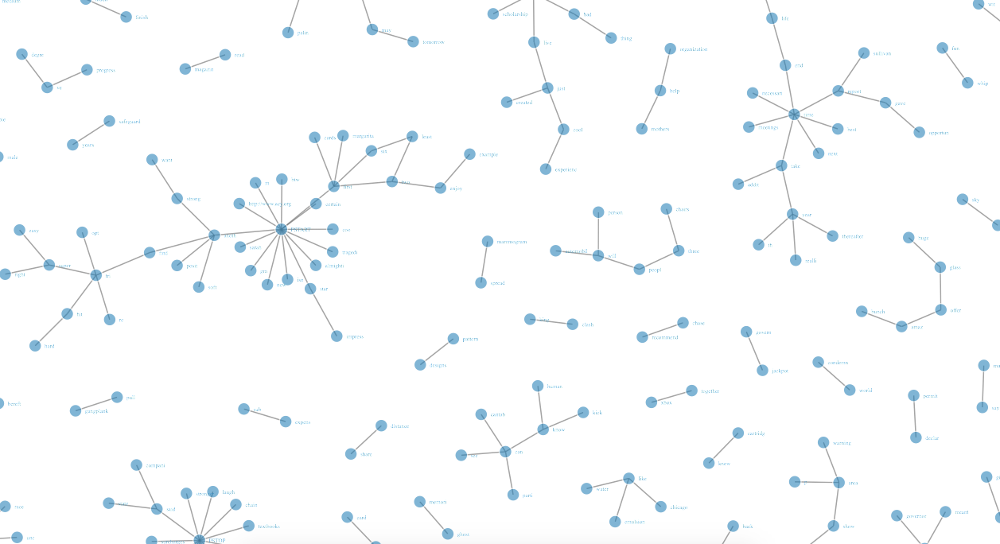

```{r, echo=FALSE, message=FALSE,warning=FALSE}
inline_hook <- function(x) {
  if (is.numeric(x)) {
    format(x, digits = 2)
  } else x
}
knitr::knit_hooks$set(inline = inline_hook)

```
# NLP Exploratory Analisys

## Introduction

Text produced by humans is a collection of words arranged in certain ways that they met some 
rules i.e. syntax, grammar, etc. and together are meaningful to other humans. Event hough,
all languages have rules that try to stablish how words should be used and how text should be 
written, there are cases when errors are made and sets of words that are meaningful do not
follow certain rules.

The meaning of a sentence or a text does not only relay on it´s structure, meaning also relies on
experiences, culture, context, etc. Sentences such as "That sucks", although it sounds like
something negative, means nothing without previous knowledge of what it makes reference to. 
Another example may be sarcasm or irony, even some humans are not able to detect and understand 
them. The fact that a collection of words are arranged following all the rules that exist in the 
language, does not guarantee that every other human that speaks the language will be able to 
understand its meaning. 

Language is not a fixed set of rules that organizes words in sentences, instead words are related
together by a set of complex rules. Syntax and grammar are not enough to model these complex
relationships, there may even be unknown relations and rules.

The main goal is to be able to predict, for a sentence, which word is most likely to be used 
next. To do this, it is necessary to create a mathematical model which describes the 
relations between words occuring in a sentence. A simple and maybe naive model would be to 
predict the next word given the set of syntactic rules that exist in a language, for example, 
"you" can be followed by a verb e.g. are, can, should, etc. This does not successfully model 
the next word because the set of words that can follow the word "you" is a very large set 
and under whis model, it is impossible to select which of them is more likely to come next.

An approach to model language complex relations, is to relay on the probability of a word 
occuring after one or more words, then, it would be possible to calculate how likely is for
a sentence to happen.

## N-grams
N-grams are sets of N words that appear in some order. In a training set, the probability of
each N-gram can be calculated by counting the number of time that it appears. As N, the number
of words in a N-gram grows, the probability of each N-gram gets smaller compared with smaller N,
also, the distribution of all N-grams tend to be more like an uniform distribution. On the
other hand, for smaller values of N, the n-gram contains less information of the relation between
words, the probability of each N-gram is larger and the distribution is less uniform.

Since the set of all words that exist in a language is a finite set (very large but finite), the
set of N-grams for each N is also finite. Thus the set of N-grams found in a training set is also
finite. Even though, in the development of a learning algorithm, as much of the information from
the training set must be presserved, some N-grams do not contain useful information, a 4-gram
such as "You car fly big", might have probability of 0, in practical terms, it never occurs.
An strategy to deal with cases where unlikely words are seen in a text must be implemented.

## Data Analisys

Here, only unigrams, bigrams and trigrams are going to be considered. Higher order unigrams do 
not occur frequently in the training set, thus the predictions based on them would look very 
simmilar to the text found in the training set.

### Imports and Utility Functions

```{r libsUtil, message=FALSE}
library(tm)
library(NLP)
library(ggplot2)
library(tidyr)
library(dplyr)
library(igraph)
library(networkD3)
library(pander)

read.HCC <- function(base.path, LOCALE="en_US", category, n.lines=-1L){
  paths <- lapply(LOCALE,function(loc){
    filename = paste(loc, category, "txt", sep=".")
    if(grepl("\\/$", base.path)){
      paste(base.path, paste(loc, filename, sep="/"), sep="")
    }else{
      paste(base.path, paste(loc, filename, sep="/"), sep="/")
    }
  })
  paths <- setNames(paths, LOCALE)
  files.HCC <- lapply(paths, function(pl){
    tmp<-lapply(pl, readLines, n=n.lines)
    setNames(tmp, category)
  })
  setNames(files.HCC, LOCALE)
}

add_pstart_pstop_tags <- function(x){
  paste('PSTART',x,'PSTOP', sep=" ")
}

profanity_tag <- function(x, profanities){
    sapply(x, function(y){if(y %in% profanities){
      return('<PROF>')
    }
      return(y)})
    
}
```


### Getting the Data

Here the data is read from the file and converted into a corpus using the tm (Text Mining) library. Due to the size of the files, only a limited number of data will be used during this
stage of the project.

```{r readData, message=FALSE}
HCCcorpus <- read.HCC(base.path = '../../data/LOCALE/', category=c('twitter', 'news', 'blogs'), n.lines = 10000)
v.corpus <- unlist(HCCcorpus)

corpus <- data.frame(names=attributes(v.corpus),
                     text=v.corpus) %>%
  separate(names, into = c('locale', 'category'), sep='\\.') %>%
  mutate(category = sapply(category, gsub, pattern='[0-9]+', replacement=''),
         text=as.character(text))
corpus$nwords <- sapply(gregexpr("\\W+", corpus$text), length) + 1
vcorp <- VCorpus(x=VectorSource(corpus$text))


prof <- readLines("../../data/profanities.txt")
```

### Document Summary
The number of lines per document i.e. tweets, news and blogs. was limited to 5000. Here, a brief
summary of the documents is presented.

```{r}
ggplot(corpus, aes(x=nwords)) + 
  geom_histogram(binwidth = 5) +
  facet_grid(.~category) +
  xlab('Number of Words') + 
  ylab('Frequency') + 
  ggtitle('Distribution of Words on Each Document by Category')
```

```{r}
out <- corpus %>%
  dplyr::group_by(category) %>%
  dplyr::summarise(Total = sum(nwords, na.rm=T), 
                   Average=mean(nwords, na.rm=T),
                   'Standard Deviation'=sd(nwords, na.rm=T))
pander(out)
```

### Data Cleaning and Preprocessing

The steps involved in the data cleaning and preprocessing are shown below.

1. Strip Whitespace removes any leading and trailing whitespaces for each document.
2. All the words in the document are converted to lowercase. This step will reduce the number of tokens and thus the number of 
N-grams.
3. Stop words are removed. This step has some consequences, some trigams that involve words from the stopwords set, are converted
into bigrams and bigrams involving stop words are converted to unigrams. Even though some information is lost, most of it is related
to syntactic rules.
4. Stem the document. This step converts words that are closely related
to a single word, e.g. cars is converted to car.
5. Add document start and stop tags to each document. This step will help the algorithm to stablish the probability of the first word
in a sentence, further improvements should be made in order to consider the effect of punctuation marks rather than the begining and
end of a document.
6. Tokenization of the document using the MC_tokenizer included with the tm library.
7. Strings of length zero are removed, no actual information in lost, strings with length zero are just an artifact introduced by
the algorithm.
8. Profanisties, rather than removed, are tagged.
9. Unigrams, bigrams and trigrams are extracted from the text.

```{r cleaningPp, message=FALSE}
vcorp <- tm_map(vcorp, stripWhitespace)
vcorp <- tm_map(vcorp, content_transformer(tolower))
vcorp <- tm_map(vcorp, removeWords, stopwords('english'))
vcorp <- tm_map(vcorp, stemDocument, language='english')
vcorp <- tm_map(vcorp, content_transformer(add_pstart_pstop_tags))
tk_corp <- tm_map(vcorp, content_transformer(MC_tokenizer))
tk_corp <- tm_map(tk_corp, content_transformer(function(x){x[x!=""]}))
tk_corp <- tm_map(tk_corp, content_transformer(profanity_tag), profanities=prof)
bigram_corp <- tm_map(tk_corp, content_transformer(ngrams), 2)
trigram_corp <- tm_map(tk_corp, content_transformer(ngrams), 3)
```

Then, having all the N-grams, the next step is to get the probability for each one, based on the number of times it appears on the
corpus. 

Since the idea behind the start and stop tags is to estimate how likely is for a word to appear as the first or last word
in the text, such tags are removed from the unigrams, otherwise a confounding relation between the size of the corpus (number of 
documents) and the frequency of the unigrams would be introduced. For a more comprehensive tokenization method e.g. a method that
involves tagging punctuation marks, this might not hold.

```{r ngramCnt, message=FALSE}
unigrams <- data.frame(unigram=unlist(sapply(tk_corp, function(x){
  x$content
}))) %>%
  dplyr::filter(unigram!='PSTOP',unigram!='PSTART') %>%
  dplyr::group_by(unigram) %>%
  dplyr::summarise(cnt=n()) %>%
  ungroup() %>%
  mutate(w0=unigram, p = cnt / sum(cnt)) %>%
  select(w0, cnt, p) %>%
  dplyr::arrange(desc(cnt))

bigrams <- data.frame(bigram=unlist(sapply(bigram_corp, function(x){
  x$content
})))  %>%
  mutate(bigram=sapply(as.character(bigram), function(x) substr(x, 4, nchar(x)-2))) %>%
  separate(bigram, into=c('w0', 'w1'), sep = "\", \"") %>%
  dplyr::group_by(w0, w1) %>%
  dplyr::summarise(cnt=n()) %>%
  ungroup() %>%
  mutate(p = cnt / sum(cnt)) %>%
  dplyr::arrange(desc(cnt))

trigrams <- data.frame(trigram=unlist(sapply(trigram_corp, function(x){
  x$content
}))) %>%
  mutate(trigram=sapply(as.character(trigram), function(x) substr(x, 4, nchar(x)-2))) %>%
  separate(trigram, into=c('w0', 'w1', 'w2'), sep = "\", \"")  %>%
  dplyr::group_by(w0, w1, w2) %>%
  dplyr::summarise(cnt=n()) %>%
  ungroup() %>%
  mutate(p = cnt / sum(cnt)) %>%
  dplyr::arrange(desc(cnt))
```


### Unigrams

In this section, some statistical properties of the unigrams are going to be examined. The mean probability 
of finding an unigram is ```r mean(unigrams$p)``` and the standard deviation ```r sd(unigrams$p)```. The 20 most frequent unigrams are shown below. 

```{r unigTable}
panderOptions("digits", 2)
pander(head(unigrams %>% 
              mutate(w0 = sapply(as.character(w0), 
                                 function(x) ifelse(x=='<PROF>', 
                                                    'Profanities', 
                                                    x))) %>% 
              transmute(Word=w0, Frequency=cnt, Probability=p), n = 20))
```


Profanities seem to be very popular, appart from profanities, some common words can be seen in the table.

The figure below shows the distribution of the probabilities for unigrams.

```{r unigHist}
ggplot(unigrams , aes(x=p)) + geom_histogram(binwidth = 0.0001)
```

### Bigrams

In this section, some statistical properties of the bigrams are going to be examined. The mean probability 
of finding an bigram is ```r mean(bigrams$p)``` and the standard deviation ```r sd(bigrams$p)```.

The 20 most frequent bigrams are shown below.

```{r bigTable}
panderOptions("digits", 2)
pander(head(bigrams %>% 
              mutate(w0 = sapply(as.character(w0), 
                                 function(x) ifelse(x=='<PROF>', 
                                                    'Profanities', 
                                                    x)),
                     w1 = sapply(as.character(w1), 
                                 function(x) ifelse(x=='<PROF>', 
                                                    'Profanities', 
                                                    x))) %>% 
              transmute(Word0=w0, Word1=w1, Frequency=cnt, Probability=p), 
            n = 20))
```


The figure below shows the distribution of the probabilities for bigrams.

```{r bigHist}
ggplot(bigrams , aes(x=p)) + geom_histogram(binwidth = 0.000001)
```


### Trigrams

In this section, some statistical properties of the trigrams are going to be examined. The mean probability 
of finding an trigram is `r mean(trigrams$p)` and the standard deviation ```r sd(trigrams$p)```. The 20 most frequent trigrams are shown below.

```{r trigTable}
panderOptions("digits", 2)
pander(head(trigrams %>% 
              mutate(w0 = sapply(as.character(w0), 
                                 function(x) ifelse(x=='<PROF>', 
                                                    'Profanities', 
                                                    x)),
                     w1 = sapply(as.character(w1), 
                                 function(x) ifelse(x=='<PROF>', 
                                                    'Profanities', 
                                                    x)),
                     w2 = sapply(as.character(w2), 
                                 function(x) ifelse(x=='<PROF>', 
                                                    'Profanities', 
                                                    x))) %>% 
              transmute(Word0=w0, Word1=w1, Word2=w2, 
                        Frequency=cnt, Probability=p), 
            n = 20))
```


The figure below shows the distribution of the probabilities for trigrams.

```{r trigHist}
ggplot(trigrams , aes(x=p)) + geom_histogram(binwidth = 0.0000001)
```

### Analisys on N-grams Distributions
One of the asumptions about the N-grams was that, as N grows, the distribution 
of the N-grams would be more uniform than those for smaller values of N. 

The set of N-grams is by definition disorganized i.e. the the concept of greater 
than and smaller than are not well defined in the N-gram sets as they are in
sets such as the integer numbers. For this reason, it is not possible to compare
the distribution of the N-grams for a given N with a known distribution using
qq-plots. Instead it is necessary to inspect the probabilities of each N-gram 
and compare them with the theoretical properties of the distribution of 
probabilities generated by a random distribution.

Let $x$ be an uniformly distributed random variable, then, for each $x$, the 
frequency would be $k$, and the probabilities are proportional to 
$\frac{k}{\sum{k}}$. 
The distribution of the probabilities of $x$ would have an standard deviation equal
or very close to zero, and would have a unique peak in $k$ or $\frac{k}{\sum{k}}$, 
respectively. On the other hand, a non uniform distribution would have frequencies 
with a larger standard deviation and more than one peak.

It was shown in the previous section that as N grows, the standard deviation becomes
smaller and less peaks are seen in the histograms.

### Bigram Graph

Unigrams do not contain information about the relation between word, bigrams 
show relations between pairs of words and higher order N-grams model more complex
word associations.

Below, a graph created from the bigrams is presented.



It can be seen in the figure above, how the formation of higher order N-grams are 
done by using the associations containd in bigrams. The weight of each path is 
derived from the propability of each bigram.

The graph was produced with a small sample of the bigrams, nevertheless, the network
produced by all the possible bigrams in the training set would also be a collection 
of disconnected graphs. The consequence of having disconected graphs is that, a 
learning algorithm that would try to guess the next most likely word to occur would
encounter nodes where there are no more possibilities. The learning algorithm would 
then need to be implemented with a way to connect those unconnected graphs with
small probablity links that are derived from the training set but that may have
not been seen during the training process.

```{r}
bigrams2 <- bigrams[sample(700),]
simpleNetwork(data.frame(bigrams2$w0, bigrams2$w1))
```

The second graph is a much more complex, interactive graph is presented above, the intention
is to show how relations change when a larger number of bigrams is used.

#### Betweenness Centrality

```{r}
bigram_graph <- graph.data.frame(bigrams %>% mutate(weight=p) %>%select(w0,w1,weight), directed = T)
```

```{r}
btnc<-as.data.frame(betweenness(bigram_graph)) 
btnc$Word <- rownames(btnc)
colnames(btnc)[1] <- 'Betweenness'
btnc <- btnc %>%
  mutate(Word = sapply(as.character(Word), 
                     function(x) ifelse(x=='<PROF>', 
                                        'Profanities', 
                                        x))) %>%
  arrange(desc(Betweenness)) %>%
  select(Word, Betweenness)
  pander(head(btnc))
```

```{r}
  ggplot(inner_join(btnc, bigrams %>% mutate(Word=w0), by='Word'),
         aes(x=p, y=Betweenness)) +
    geom_point() +
    xlab('Unigram Probability') +
    ylab('Unigram Betweenness') +
    ggtitle('Unigram Betweenness vs. Unigram Probability')
```

### Further Work on Trigrams

It is not easy to see why higher order N-grams is useful. distributions are mostly
uniform i.e. most N-grams are equaly likely to happen. In this section a discussion 
is performed in order to gain some insight on the trigrams.

As mentioned in the previous sections, the distribution of the trigrams is nearly 
uniform, the issue with this is that most trigrams are equaly likely to ocur. By
the nature of the trigrams i.e. it´s structure, trigrams may be useful to model
words that relate pairs of words, for example, in the sentence "You can travel by
car, bycicle, motorcycle, airplanes and \<unknown\>", it is not likely that the next 
word would be "apples", "bus" or "train" are more likely to occur instead. The 
bigram "and" - "\<unknown\>", trying to predict the next word would have no knowledge 
of the items being listed, then, "apples" would be likely to occur. On the other 
hand the incomplete trigram "airplanes" - "and" - "\<unknown\>" would have knowledge 
of the one of the items being listed, therefore it might predict the next word 
better than the bigram by itself.

If the subset of N-grams for a given N that are related to a syntactic structure
such as a list are filtered, it might be possible to create algorithms may have a 
better knowledge of the context of the sentence.

## Conclusions
* Given the strong influence of profanities, such words should be handled by the learning
algorithm rather than being discarded from the training set.
* As N becomes larger, N-gram distributions become more uniform.
* A more efficient way of handling the large datasets will have to be implemented for the shiny app.
